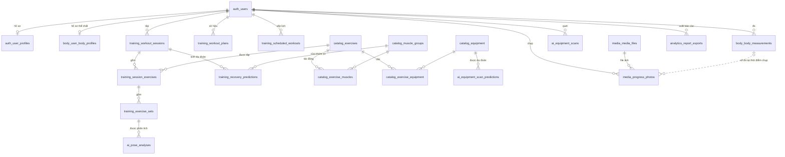
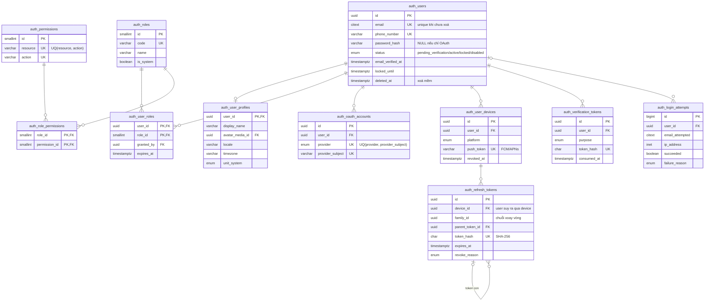
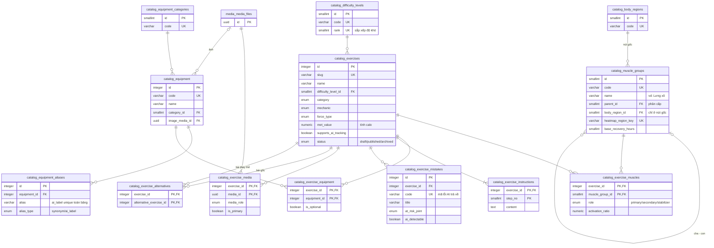
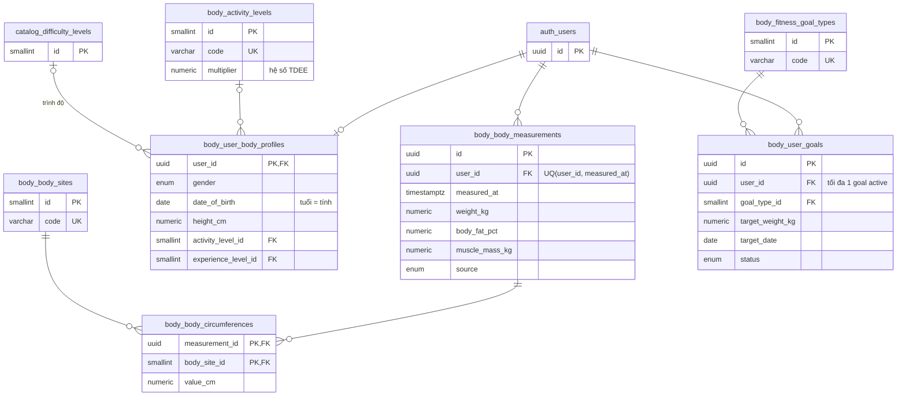
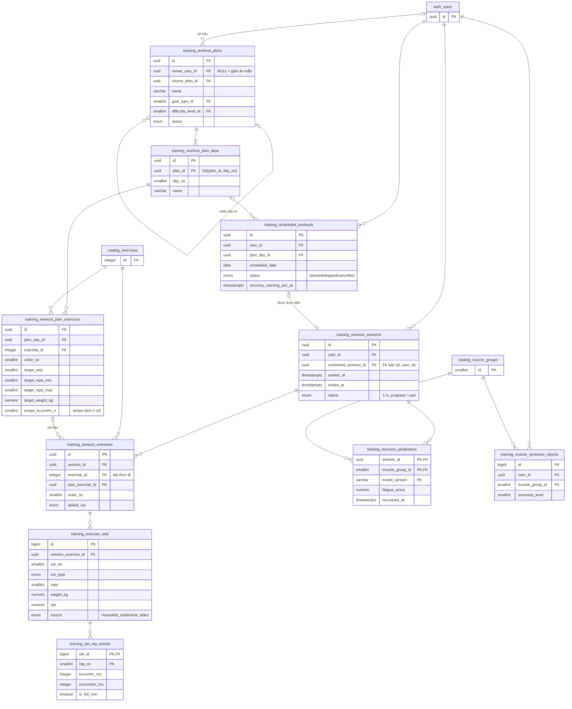
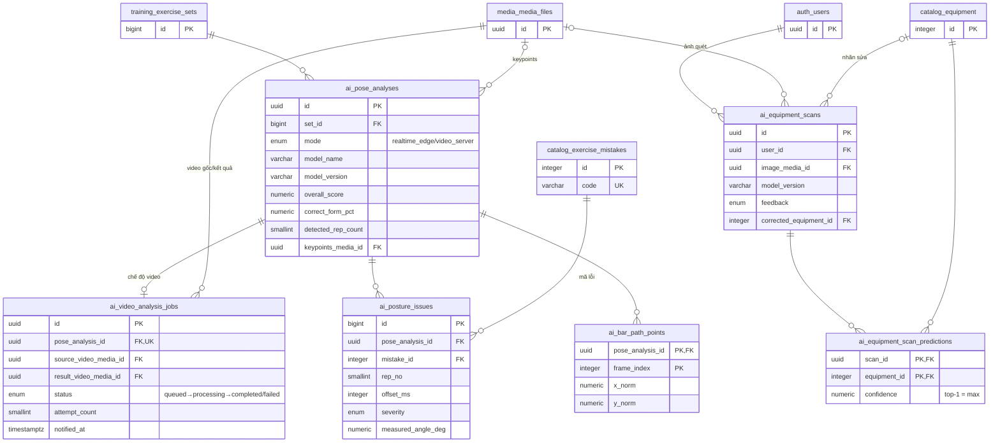
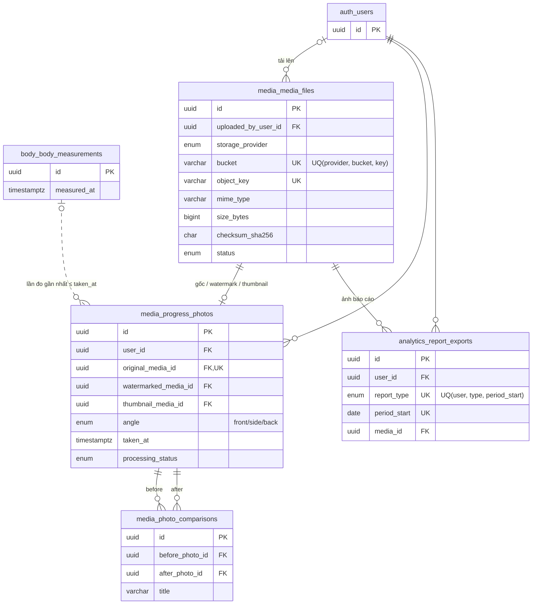

# Sơ đồ thực thể – quan hệ (ERD) — Smart Workout AI

> PostgreSQL 16 · 7 schema nghiệp vụ · 51 bảng. Tên thực thể trong sơ đồ được viết dạng `schema_table`
> (Mermaid không cho phép dấu chấm), ví dụ `training_workout_sessions` = `training.workout_sessions`.
> Chi tiết từng cột xem [data-dictionary.md](data-dictionary.md).

Ký hiệu Mermaid: `||` đúng một · `o|` không hoặc một · `o{` không hoặc nhiều · `|{` một hoặc nhiều.
Nét liền = khoá ngoại thật; nét đứt (`..`) = quan hệ **logic** được suy ra bằng truy vấn (không lưu FK — xem [normalization.md](normalization.md)).

## 1. Tổng quan giữa các module

## 2. `auth` — Định danh & phân quyền (RBAC)

## 3. `catalog` — Thư viện bài tập (Exercise Wiki)

## 4. `body` — Chỉ số cơ thể & mục tiêu

## 5. `training` — Giáo án, lịch tập, buổi tập, phục hồi

## 6. `ai` — Phân tích tư thế & nhận diện thiết bị

## 7. `media` & `analytics` — File, Progress Gallery, báo cáo

